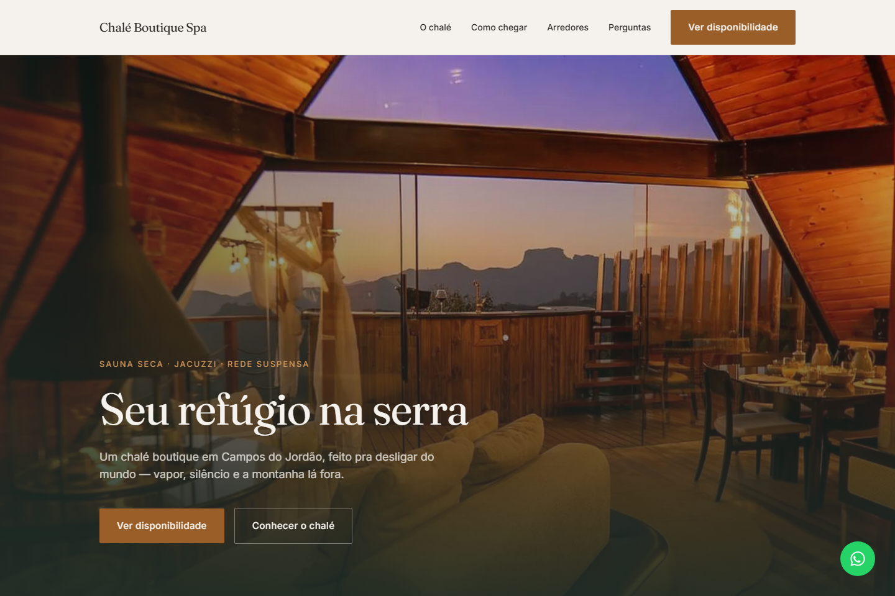
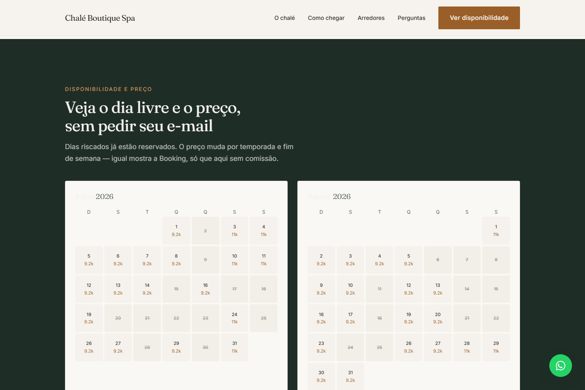
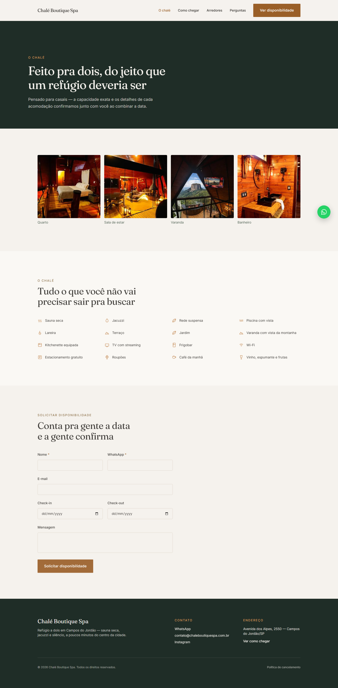

# Chalé Boutique Spa


Landing de reserva direta para um chalé boutique em Campos do Jordão — recupera o tráfego de quem já busca a propriedade nas OTAs e devolve ao anfitrião o controle sobre preço, fotos e narrativa.



## Links

- Não há domínio publicado ainda: o nome/fotos da propriedade real dependem de autorização do anfitrião (ver [nota sobre a marca](#a-solução) abaixo) — o `SITE_URL` no código é um placeholder até isso acontecer.
- Não é um projeto de API com Swagger — a única rota de backend é o formulário de lead, documentada [abaixo](#prints--o-site-rodando) com exemplo real de request/response.

## O problema

O chalé hoje é vendido só via OTAs (Booking, Airbnb): o anfitrião paga comissão em cada reserva, não controla a narrativa/fotos da própria propriedade, e perde o contato direto com quem já decidiu se hospedar ali. Quem busca o nome da propriedade no Google não tem pra onde ir além do perfil na OTA.

O público é específico: casais planejando uma escapada romântica, pesquisando à noite, no celular, com o Booking ou Airbnb já abertos em outra aba — já decidiram o destino, estão decidindo o canal.

## A solução

Site institucional + canal de reserva direta, com uma escada de crença deliberada: (1) isto é um lugar real — prova externa (nota 9,4 no Booking, linkada); (2) reservar direto é vantajoso — sem taxa de serviço; (3) é fácil e rápido — calendário visível, WhatsApp com data pré-preenchida, sem cadastro; (4) confiança suficiente pra fechar aqui em vez de voltar à OTA.

CTA duplo: **"Ver disponibilidade"** (calendário + WhatsApp pré-preenchido) como primária, **"Perguntar no WhatsApp"** como fallback pra quem ainda não decidiu a data.

**Nota sobre a marca real:** o uso do nome, endereço e fotos da propriedade real depende de autorização do anfitrião. Esta implementação usa o nome e o posicionamento dos documentos de planejamento como conteúdo de demonstração, mas as fotos são composições visuais (licenciadas), não fotografia da propriedade real — trocar por fotos autorizadas antes de publicar com a marca real.

## Prints — o site rodando

Calendário de disponibilidade — mês a mês, preço por diária, dias reservados riscados, **sem pedir e-mail**:



Página "O chalé" — galeria, lista de amenidades (ícones SVG, não emoji) e formulário de lead:



Mobile — o cenário que decide o projeto (o público real decide "às 23h, no celular"):


A única rota de backend é o formulário de lead (`POST /api/lead`) — sem banco de dados, loga estruturado no servidor se não houver `RESEND_API_KEY` configurada:

```bash
curl -X POST http://localhost:3000/api/lead \
  -H "Content-Type: application/json" \
  -d '{
    "name": "Ana Beatriz Costa",
    "phone": "+5512988887777",
    "email": "ana.costa@example.com",
    "checkIn": "2026-08-14",
    "checkOut": "2026-08-16",
    "message": "Aniversário de casamento, gostaríamos de saber disponibilidade."
  }'

# → 200 {"ok":true}
# (sem RESEND_API_KEY: o lead é logado estruturado no servidor, não se perde)
```

```bash
curl -X POST http://localhost:3000/api/lead -d '{"email":"sem-nome@example.com"}'
# → 400 {"error":"Nome e WhatsApp são obrigatórios."}
```

## Stack

| Camada | Tecnologia |
|---|---|
| Framework | Next.js 16 (App Router, Turbopack) |
| UI | React 19 + TypeScript |
| Estilo | Tailwind CSS v4, tokens de cor/tipografia próprios (ver `DESIGN.md`) |
| Fontes | Fraunces (display) + Inter (corpo), via `next/font/google` |
| Lead | Rota própria (`app/api/lead`), e-mail opcional via Resend |
| SEO | Metadata da App Router + JSON-LD (`schema.org/LodgingBusiness`) + OpenGraph dinâmico |
| Deploy alvo | Vercel |

## Como rodar localmente

```bash
npm install

cp .env.example .env.local
# opcional: preencher RESEND_API_KEY/LEAD_TO_EMAIL pra receber lead por e-mail;
# sem isso, o lead só é logado no servidor — suficiente pra rodar localmente

npm run dev
# abre em http://localhost:3000
```

```bash
# build de produção
npm run build
npm start
```

## Decisões técnicas

### PRNG determinístico no calendário de disponibilidade

`lib/availability.ts` gera os dados de demonstração com um PRNG determinístico (mulberry32), semeado por ano+mês, em vez de `Math.random()`. Isso evita o erro clássico de hidratação do Next.js (SSR e cliente calculando valores "aleatórios" diferentes) e mantém o mock estável entre renders do mesmo dia. Quando o feed real (iCal do Airbnb/Booking) entrar, só a fonte de dados muda — a lógica de exibição (preço/dia, bloqueado/livre, fim de semana vs. temporada alta) já é a real.

### Reveal-on-scroll nunca esconde conteúdo permanentemente

`components/Reveal.tsx` marca o conteúdo visível por padrão no CSS; a classe que dispara a animação só é adicionada depois que o efeito React roda. Isso significa que sem JavaScript, ou se o `IntersectionObserver` nunca disparar (screenshot headless sem scroll, navegador exótico), o conteúdo aparece de qualquer jeito — tem inclusive um `setTimeout` de segurança de 1,5s como rede final. Reveals são decoração; nunca podem virar a razão de uma seção sumir.

### Acordeão de FAQ sem JavaScript nenhum

`FaqAccordion` usa `<details>`/`<summary>` nativos em vez de um componente controlado por estado — acessível por teclado e leitor de tela de graça, zero JS pro comportamento de abrir/fechar em si (só o ícone de "+" que gira usa uma transição CSS).

### Lead sem banco de dados, "liga" o e-mail trocando uma env var

`app/api/lead/route.ts` não depende de nenhum banco: se `RESEND_API_KEY` não estiver configurada, o lead é logado estruturado no servidor — dá pra rodar e testar o fluxo inteiro localmente sem nenhuma credencial. Em produção, só configurar a env var liga o envio por e-mail via Resend, sem mudar código.

### SEO local pensado desde o layout raiz

`app/layout.tsx` já sai com JSON-LD (`schema.org/LodgingBusiness`, com endereço, coordenadas, nota do Booking e lista de amenidades) e OpenGraph completo — não é um afterthought de v2. Fontes carregadas via `next/font/google` (não `<link>`) pra zero layout shift e `font-display: swap` automático.

### A paleta foge de propósito do "SaaS genérico"

`DESIGN.md` documenta anti-referências explícitas: nada de teal, neon, glassmorphism ou gradiente roxo — a paleta é Névoa/Carvão/Cobre (neutros quentes + cobre mineral), pensada pra "madeira, névoa da serra, vapor de sauna", não pra dashboard. Contraste mínimo 4.5:1 em texto de parágrafo é regra não-negociável, documentada por token na própria tabela de cores.

## Testes

Não há suíte de testes automatizados ainda (nenhum Jest/Vitest/Playwright configurado) — isso está em [o que eu faria diferente](#o-que-eu-faria-diferente). O que foi verificado de verdade nesta rodada:

- `npm run lint` (ESLint) e `npx tsc --noEmit` — limpos, zero avisos.
- `npm run build` — gera com sucesso 11 rotas estáticas + 1 rota dinâmica (`/api/lead`).
- `POST /api/lead` testado de verdade contra o servidor rodando: sucesso com payload completo e erro 400 com campo obrigatório faltando (exemplos [acima](#prints--o-site-rodando)).
- Navegação real num Chromium headless (desktop e mobile), sem erro de console.
- CI (`.github/workflows/ci.yml`) rodando lint + type check + build a cada push.

## O que eu faria diferente

- Adicionaria testes de verdade: Vitest pra `lib/availability.ts` (lógica pura, fácil de testar) e Playwright pro fluxo do formulário de lead e do calendário.
- Validaria o envio de e-mail via Resend com uma API key de teste antes de chamar essa integração de "pronta" — hoje só o caminho de log (sem `RESEND_API_KEY`) foi exercitado de verdade.
- Colocaria rate limit em `/api/lead` antes de produção — hoje aceita qualquer POST sem limite.
- Trocaria as imagens placeholder por fotos reais assim que o anfitrião autorizar, e o `SITE_URL`/WhatsApp placeholder pelos dados reais.

## Licença

MIT — veja [LICENSE](LICENSE).
